# System Architecture Analysis

## Overview

- **Project**: /home/tom/github/maskservice/c2004/dsl
- **Primary Language**: python
- **Languages**: python: 18, typescript: 4, shell: 1, javascript: 1
- **Analysis Mode**: static
- **Total Functions**: 61
- **Total Classes**: 23
- **Modules**: 24
- **Entry Points**: 50

## Architecture by Module

### frontend.src.main
- **Functions**: 32
- **Classes**: 2
- **File**: `main.ts`

### client
- **Functions**: 24
- **Classes**: 6
- **File**: `__init__.py`

### core
- **Functions**: 9
- **File**: `index.ts`

### api
- **Functions**: 8
- **File**: `__init__.py`

### core.types
- **Functions**: 0
- **Classes**: 15
- **File**: `types.ts`

## Key Entry Points

Main execution flows into the system:

### frontend.src.main.DslEditorApp.formData
- **Calls**: frontend.src.main.fetch, frontend.src.main.stringify, frontend.src.main.DslEditorApp.alert, frontend.src.main.DslEditorApp._refresh, frontend.src.main.json

### frontend.src.main.DslEditorApp.data
- **Calls**: frontend.src.main.fetch, frontend.src.main.stringify, frontend.src.main.DslEditorApp.alert, frontend.src.main.DslEditorApp._refresh, frontend.src.main.json

### core.replay
- **Calls**: core.getDslRuntime, core.getSessionRecorder, core.getSession, core.getSessionPlayer, core.play

### core.session
- **Calls**: core.getDslRuntime, core.getSessionPlayer, core.play

### client.DslClient._get
- **Calls**: self.client.get, response.raise_for_status, response.json

### client.DslClient._post
- **Calls**: self.client.post, response.raise_for_status, response.json

### client.DslClient._delete
- **Calls**: self.client.delete, response.raise_for_status, response.json

### core.exec
- **Calls**: core.getDslRuntime, core.execute

### core.run
- **Calls**: core.getDslRuntime, core.executeScript

### core.navigate
- **Calls**: core.getDslRuntime, core.execute

### core.startRecording
- **Calls**: core.getDslRuntime, core.getSessionRecorder

### core.stopRecording
- **Calls**: core.getDslRuntime, core.getSessionRecorder

### core.connect
- **Calls**: core.getDslRuntime, core.connectToCli

### client.DslClient.__init__
- **Calls**: base_url.rstrip, httpx.Client

### client.DslClient.list_functions
- **Calls**: self._get, DslFunction

### client.DslClient.get_function
- **Calls**: self._get, DslFunction

### client.DslClient.create_function
- **Calls**: self._post, DslFunction

### client.DslClient.list_objects
- **Calls**: self._get, DslObject

### client.DslClient.get_object
- **Calls**: self._get, DslObject

### client.DslClient.create_object
- **Calls**: self._post, DslObject

### client.DslClient.list_params
- **Calls**: self._get, DslParam

### client.DslClient.create_param
- **Calls**: self._post, DslParam

### client.DslClient.list_units
- **Calls**: self._get, DslUnit

### client.DslClient.create_unit
- **Calls**: self._post, DslUnit

### client.DslClient.list_variables
- **Calls**: self._get, Variable

### client.DslClient.create_variable
- **Calls**: self._post, Variable

### frontend.src.main.DslEditorApp.init
- **Calls**: frontend.src.main.DslEditorApp._refresh

### frontend.src.main.DslEditorApp.response
- **Calls**: frontend.src.main.fetch

### frontend.src.main.DslEditorApp.target
- **Calls**: frontend.src.main.DslEditorApp._refresh

### frontend.src.main.DslEditorApp.li
- **Calls**: frontend.src.main.DslEditorApp.showDetails

## Process Flows

Key execution flows identified:

### Flow 1: formData
```
formData [frontend.src.main.DslEditorApp]
  └─> alert
  └─> _refresh
      └─> loadSchema
          └─> error
      └─> render
```

### Flow 2: data
```
data [frontend.src.main.DslEditorApp]
  └─> alert
  └─> _refresh
      └─> loadSchema
          └─> error
      └─> render
```

### Flow 3: replay
```
replay [core]
```

### Flow 4: session
```
session [core]
```

### Flow 5: _get
```
_get [client.DslClient]
```

### Flow 6: _post
```
_post [client.DslClient]
```

### Flow 7: _delete
```
_delete [client.DslClient]
```

### Flow 8: exec
```
exec [core]
```

### Flow 9: run
```
run [core]
```

### Flow 10: navigate
```
navigate [core]
```

## Key Classes

### frontend.src.main.DslEditorApp
- **Methods**: 32
- **Key Methods**: frontend.src.main.DslEditorApp.init, frontend.src.main.DslEditorApp._refresh, frontend.src.main.DslEditorApp._onAction, frontend.src.main.DslEditorApp.loadSchema, frontend.src.main.DslEditorApp.response, frontend.src.main.DslEditorApp.render, frontend.src.main.DslEditorApp.app, frontend.src.main.DslEditorApp.renderList, frontend.src.main.DslEditorApp.setupEventListeners, frontend.src.main.DslEditorApp.app

### client.DslClient
> Client for DSL Service API
- **Methods**: 23
- **Key Methods**: client.DslClient.__init__, client.DslClient._get, client.DslClient._post, client.DslClient._delete, client.DslClient.health, client.DslClient.list_functions, client.DslClient.get_function, client.DslClient.create_function, client.DslClient.delete_function, client.DslClient.list_objects

### frontend.src.main.DslSchema
- **Methods**: 0

### core.types.ApiCommand
- **Methods**: 0

### core.types.ActionCommand
- **Methods**: 0

### core.types.ComponentDefinition
- **Methods**: 0

### core.types.ComponentCommand
- **Methods**: 0

### core.types.UIState
- **Methods**: 0

### core.types.StateCommand
- **Methods**: 0

### core.types.ProcessStep
- **Methods**: 0

### core.types.ProcessDefinition
- **Methods**: 0

### core.types.ProcessInstance
- **Methods**: 0

### core.types.ProcessCommand
- **Methods**: 0

### core.types.SessionRecording
- **Methods**: 0

### core.types.SessionCommand
- **Methods**: 0

### core.types.ReplayCommand
- **Methods**: 0

### core.types.DslExecutionContext
- **Methods**: 0

### core.types.DslExecutionResult
- **Methods**: 0

### client.DslFunction
- **Methods**: 0

### client.DslObject
- **Methods**: 0

## Data Transformation Functions

Key functions that process and transform data:

## Behavioral Patterns

### state_machine_DslClient
- **Type**: state_machine
- **Confidence**: 0.70
- **Functions**: client.DslClient.__init__, client.DslClient._get, client.DslClient._post, client.DslClient._delete, client.DslClient.health

## Public API Surface

Functions exposed as public API (no underscore prefix):

- `frontend.src.main.DslEditorApp.showCreateForm` - 14 calls
- `frontend.src.main.DslEditorApp.setupEventListeners` - 8 calls
- `frontend.src.main.DslEditorApp.formData` - 5 calls
- `frontend.src.main.DslEditorApp.data` - 5 calls
- `core.replay` - 5 calls
- `frontend.src.main.DslEditorApp.loadSchema` - 4 calls
- `frontend.src.main.DslEditorApp.render` - 3 calls
- `frontend.src.main.DslEditorApp.showDetails` - 3 calls
- `core.session` - 3 calls
- `frontend.src.main.DslEditorApp.renderList` - 2 calls
- `core.exec` - 2 calls
- `core.run` - 2 calls
- `core.navigate` - 2 calls
- `core.startRecording` - 2 calls
- `core.stopRecording` - 2 calls
- `core.connect` - 2 calls
- `client.DslClient.list_functions` - 2 calls
- `client.DslClient.get_function` - 2 calls
- `client.DslClient.create_function` - 2 calls
- `client.DslClient.list_objects` - 2 calls
- `client.DslClient.get_object` - 2 calls
- `client.DslClient.create_object` - 2 calls
- `client.DslClient.list_params` - 2 calls
- `client.DslClient.create_param` - 2 calls
- `client.DslClient.list_units` - 2 calls
- `client.DslClient.create_unit` - 2 calls
- `client.DslClient.list_variables` - 2 calls
- `client.DslClient.create_variable` - 2 calls
- `frontend.src.main.DslEditorApp.init` - 1 calls
- `frontend.src.main.DslEditorApp.response` - 1 calls
- `frontend.src.main.DslEditorApp.target` - 1 calls
- `frontend.src.main.DslEditorApp.li` - 1 calls
- `frontend.src.main.DslEditorApp.editor` - 1 calls
- `frontend.src.main.DslEditorApp.endpoint` - 1 calls
- `frontend.src.main.DslEditorApp.error` - 1 calls
- `core.dsl` - 1 calls
- `api.health` - 1 calls
- `api.list_functions` - 1 calls
- `api.list_objects` - 1 calls
- `api.list_params` - 1 calls

## System Interactions

How components interact:

```mermaid
graph TD
    formData --> fetch
    formData --> stringify
    formData --> alert
    formData --> _refresh
    formData --> json
    data --> fetch
    data --> stringify
    data --> alert
    data --> _refresh
    data --> json
    replay --> getDslRuntime
    replay --> getSessionRecorder
    replay --> getSession
    replay --> getSessionPlayer
    replay --> play
    session --> getDslRuntime
    session --> getSessionPlayer
    session --> play
    _get --> get
    _get --> raise_for_status
    _get --> json
    _post --> post
    _post --> raise_for_status
    _post --> json
    _delete --> delete
    _delete --> raise_for_status
    _delete --> json
    exec --> getDslRuntime
    exec --> execute
    run --> getDslRuntime
```



## Reverse Engineering Guidelines

1. **Entry Points**: Start analysis from the entry points listed above
2. **Core Logic**: Focus on classes with many methods
3. **Data Flow**: Follow data transformation functions
4. **Process Flows**: Use the flow diagrams for execution paths
5. **API Surface**: Public API functions reveal the interface

## Context for LLM

Maintain the identified architectural patterns and public API surface when suggesting changes.