# System Architecture Analysis

## Overview

- **Project**: /home/tom/github/oqlos/cql
- **Primary Language**: typescript
- **Languages**: typescript: 224, javascript: 20, python: 5, shell: 1
- **Analysis Mode**: static
- **Total Functions**: 5071
- **Total Classes**: 178
- **Modules**: 250
- **Entry Points**: 3757

## Architecture by Module

### legacy.modules.connect-scenario.helpers.scenarios.ui-window-handlers
- **Functions**: 178
- **File**: `scenarios.ui-window-handlers.ts`

### legacy.pages.connect-scenario-library-editor.page
- **Functions**: 174
- **Classes**: 1
- **File**: `connect-scenario-library-editor.page.ts`

### legacy.pages.connect-scenario-dsl-editor.page
- **Functions**: 169
- **Classes**: 1
- **File**: `connect-scenario-dsl-editor.page.ts`

### legacy.pages.connect-scenario-scenario-editor.page
- **Functions**: 155
- **Classes**: 1
- **File**: `connect-scenario-scenario-editor.page.ts`

### legacy.pages.connect-scenario-map-editor.page
- **Functions**: 150
- **Classes**: 2
- **File**: `connect-scenario-map-editor.page.ts`

### legacy.modules.connect-scenario.helpers.scenarios.ui-container-handlers
- **Functions**: 148
- **Classes**: 1
- **File**: `scenarios.ui-container-handlers.ts`

### legacy.modules.connect-scenario.helpers.scenarios.serializer
- **Functions**: 138
- **Classes**: 1
- **File**: `scenarios.serializer.ts`

### legacy.components.dsl.dsl.parser
- **Functions**: 111
- **File**: `dsl.parser.ts`

### runtime.dsl.parser
- **Functions**: 111
- **File**: `dsl.parser.ts`

### legacy.modules.connect-scenario.helpers.scenarios.library
- **Functions**: 105
- **Classes**: 1
- **File**: `scenarios.library.ts`

### legacy.pages.connect-scenario-scenarios.page
- **Functions**: 105
- **Classes**: 1
- **File**: `connect-scenario-scenarios.page.ts`

### legacy.components.dsl.dsl-tools
- **Functions**: 98
- **Classes**: 1
- **File**: `dsl-tools.ts`

### runtime.dsl-tools
- **Functions**: 98
- **Classes**: 1
- **File**: `dsl-tools.ts`

### legacy.components.dsl.dsl.xml
- **Functions**: 93
- **File**: `dsl.xml.ts`

### legacy.pages.connect-scenario-map-editor.map-editor.crud
- **Functions**: 93
- **Classes**: 2
- **File**: `map-editor.crud.ts`

### runtime.dsl.xml
- **Functions**: 93
- **File**: `dsl.xml.ts`

### legacy.modules.connect-scenario.helpers.goal-run.runtime
- **Functions**: 90
- **File**: `goal-run.runtime.ts`

### legacy.components.dsl-def.def-syntax-highlighter
- **Functions**: 83
- **Classes**: 2
- **File**: `def-syntax-highlighter.ts`

### legacy.components.dsl.dsl.migrate.xml
- **Functions**: 79
- **File**: `dsl.migrate.xml.ts`

### legacy.modules.connect-scenario.helpers.def-integration
- **Functions**: 79
- **Classes**: 1
- **File**: `def-integration.ts`

## Key Entry Points

Main execution flows into the system:

### legacy.pages.connect-scenario-library-editor.page.LibraryEditorPage.page
- **Calls**: legacy.pages.connect-scenario-library-editor.page.bindLibraryEditorEvents, legacy.pages.connect-scenario-library-editor.page.LibraryEditorPage.switchToScenario, legacy.pages.connect-scenario-library-editor.page.getElementById, legacy.pages.connect-scenario-library-editor.page.LibraryEditorPage.renderScenariosList, legacy.pages.connect-scenario-library-editor.page.LibraryEditorPage.showAddScenarioModal, legacy.pages.connect-scenario-library-editor.page.LibraryEditorPage.createNewScenario, legacy.pages.connect-scenario-library-editor.page.LibraryEditorPage.highlightSource, legacy.pages.connect-scenario-library-editor.page.LibraryEditorPage.updateUrlWithTab

### legacy.components.dsl.dsl.parser.parseDsl
- **Calls**: legacy.components.dsl.dsl.parser.split, legacy.components.dsl.dsl.parser.trim, legacy.components.dsl.dsl.parser.normalizeQuotedDslLine, legacy.components.dsl.dsl.parser.match, legacy.components.dsl.dsl.parser.parseGoalLine, legacy.components.dsl.dsl.parser.parseFuncLine, legacy.components.dsl.dsl.parser.parseFuncCallLine, legacy.components.dsl.dsl.parser.addError

### legacy.pages.connect-scenario-scenarios.page.ScenariosPage.attachEventListeners
- **Calls**: legacy.pages.connect-scenario-scenarios.page.querySelector, legacy.pages.connect-scenario-scenarios.page.getAttribute, legacy.pages.connect-scenario-scenarios.page.setAttribute, legacy.pages.connect-scenario-scenarios.page.ScenariosPage.refreshBuilderOptions, legacy.pages.connect-scenario-scenarios.page.setupScenariosPage, legacy.pages.connect-scenario-scenarios.page.ScenariosPage.updatePreview, legacy.pages.connect-scenario-scenarios.page.ScenariosPage.initializeDragAndDrop, legacy.pages.connect-scenario-scenarios.page.ScenariosPage.renderScenarioList

### runtime.dsl.parser.parseDsl
- **Calls**: runtime.dsl.parser.split, runtime.dsl.parser.trim, runtime.dsl.parser.normalizeQuotedDslLine, runtime.dsl.parser.match, runtime.dsl.parser.parseGoalLine, runtime.dsl.parser.parseFuncLine, runtime.dsl.parser.parseFuncCallLine, runtime.dsl.parser.addError

### legacy.pages.connect-scenario-map-editor.page.MapEditorPage.attachEventListeners
- **Calls**: legacy.pages.connect-scenario-map-editor.page.querySelector, legacy.pages.connect-scenario-map-editor.page.getElementById, legacy.pages.connect-scenario-map-editor.page.querySelectorAll, legacy.pages.connect-scenario-map-editor.page.forEach, legacy.pages.connect-scenario-map-editor.page.addEventListener, legacy.pages.connect-scenario-map-editor.page.getAttribute, legacy.pages.connect-scenario-map-editor.page.MapEditorPage.switchTab, legacy.pages.connect-scenario-map-editor.page.URLSearchParams

### legacy.modules.connect-scenario.helpers.func-editor-bindings.attachFuncEditorListeners
- **Calls**: legacy.modules.connect-scenario.helpers.func-editor-bindings.querySelector, legacy.modules.connect-scenario.helpers.func-editor-bindings.getElementById, legacy.modules.connect-scenario.helpers.func-editor-bindings.initializeSyntaxHelp, legacy.modules.connect-scenario.helpers.func-editor-bindings.setupListClickHandler, legacy.modules.connect-scenario.helpers.func-editor-bindings.loadScenarioList, legacy.modules.connect-scenario.helpers.func-editor-bindings.addEventListener, legacy.modules.connect-scenario.helpers.func-editor-bindings.setScenarioFilter, legacy.modules.connect-scenario.helpers.func-editor-bindings.toLowerCase

### legacy.modules.connect-scenario.helpers.scenarios.controller.setupScenariosPage
- **Calls**: legacy.modules.connect-scenario.helpers.scenarios.controller.updatePreview, legacy.modules.connect-scenario.helpers.scenarios.controller.initializeFuncEditorHighlighting, legacy.modules.connect-scenario.helpers.scenarios.controller.wiring, legacy.modules.connect-scenario.helpers.scenarios.controller.attach, legacy.modules.connect-scenario.helpers.scenarios.controller.methods, legacy.modules.connect-scenario.helpers.scenarios.controller.getAttribute, legacy.modules.connect-scenario.helpers.scenarios.controller.setAttribute, legacy.modules.connect-scenario.helpers.scenarios.controller.setupUiBridge

### legacy.modules.connect-scenario.helpers.scenarios.save.saveScenario
- **Calls**: legacy.modules.connect-scenario.helpers.scenarios.save.getElementById, legacy.modules.connect-scenario.helpers.scenarios.save.trim, legacy.modules.connect-scenario.helpers.scenarios.save.notifyBottomLine, legacy.modules.connect-scenario.helpers.scenarios.save.collectGoalsFromDOM, legacy.modules.connect-scenario.helpers.scenarios.save.collectFuncsFromDOM, legacy.modules.connect-scenario.helpers.scenarios.save.scenarioToDsl, legacy.modules.connect-scenario.helpers.scenarios.save.startsWith, legacy.modules.connect-scenario.helpers.scenarios.save.split

### legacy.pages.connect-scenario-library-editor.library-editor.events.bindLibraryEditorEvents
- **Calls**: legacy.pages.connect-scenario-library-editor.library-editor.events.addEventListener, legacy.pages.connect-scenario-library-editor.library-editor.events.closest, legacy.pages.connect-scenario-library-editor.library-editor.events.switchToScenario, legacy.pages.connect-scenario-library-editor.library-editor.events.getElementById, legacy.pages.connect-scenario-library-editor.library-editor.events.renderScenariosList, legacy.pages.connect-scenario-library-editor.library-editor.events.showAddScenarioModal, legacy.pages.connect-scenario-library-editor.library-editor.events.createNewScenario, legacy.pages.connect-scenario-library-editor.library-editor.events.matches

### legacy.modules.connect-scenario.helpers.scenarios.ui-container-handlers.handleRemoveFunction
- **Calls**: legacy.modules.connect-scenario.helpers.scenarios.ui-container-handlers.closest, legacy.modules.connect-scenario.helpers.scenarios.ui-container-handlers._getOrCreateSelect, legacy.modules.connect-scenario.helpers.scenarios.ui-container-handlers.trim, legacy.modules.connect-scenario.helpers.scenarios.ui-container-handlers.confirmAction, legacy.modules.connect-scenario.helpers.scenarios.ui-container-handlers.getElementById, legacy.modules.connect-scenario.helpers.scenarios.ui-container-handlers.getCurrentScenarioId, legacy.modules.connect-scenario.helpers.scenarios.ui-container-handlers.readScenarioIdFromUrl, legacy.modules.connect-scenario.helpers.scenarios.ui-container-handlers.replace

### legacy.modules.connect-scenario.helpers.scenarios.ui-container-handlers.handleRemoveObject
- **Calls**: legacy.modules.connect-scenario.helpers.scenarios.ui-container-handlers.closest, legacy.modules.connect-scenario.helpers.scenarios.ui-container-handlers._getOrCreateSelect, legacy.modules.connect-scenario.helpers.scenarios.ui-container-handlers.trim, legacy.modules.connect-scenario.helpers.scenarios.ui-container-handlers.confirmAction, legacy.modules.connect-scenario.helpers.scenarios.ui-container-handlers.getElementById, legacy.modules.connect-scenario.helpers.scenarios.ui-container-handlers.getCurrentScenarioId, legacy.modules.connect-scenario.helpers.scenarios.ui-container-handlers.readScenarioIdFromUrl, legacy.modules.connect-scenario.helpers.scenarios.ui-container-handlers.replace

### legacy.modules.connect-scenario.helpers.scenarios.list.renderScenarioList
- **Calls**: legacy.modules.connect-scenario.helpers.scenarios.list.getElementById, legacy.modules.connect-scenario.helpers.scenarios.list.listScenarios, legacy.modules.connect-scenario.helpers.scenarios.list.String, legacy.modules.connect-scenario.helpers.scenarios.list.trim, legacy.modules.connect-scenario.helpers.scenarios.list.Number, legacy.modules.connect-scenario.helpers.scenarios.list.isNaN, legacy.modules.connect-scenario.helpers.scenarios.list.isFinite, legacy.modules.connect-scenario.helpers.scenarios.list.parse

### legacy.modules.connect-scenario.helpers.scenarios.save.cloneScenario
- **Calls**: legacy.modules.connect-scenario.helpers.scenarios.save.getElementById, legacy.modules.connect-scenario.helpers.scenarios.save.trim, legacy.modules.connect-scenario.helpers.scenarios.save.collectGoalsFromDOM, legacy.modules.connect-scenario.helpers.scenarios.save.collectFuncsFromDOM, legacy.modules.connect-scenario.helpers.scenarios.save.scenarioToDsl, legacy.modules.connect-scenario.helpers.scenarios.save.startsWith, legacy.modules.connect-scenario.helpers.scenarios.save.split, legacy.modules.connect-scenario.helpers.scenarios.save.slice

### legacy.modules.connect-scenario.helpers.def-integration.event-bindings.bindDefIntegrationEventHandlers
- **Calls**: legacy.modules.connect-scenario.helpers.def-integration.event-bindings.MutationObserver, legacy.modules.connect-scenario.helpers.def-integration.event-bindings.isBuilderSelectTarget, legacy.modules.connect-scenario.helpers.def-integration.event-bindings.onScheduleSyncDefLibrary, legacy.modules.connect-scenario.helpers.def-integration.event-bindings.onDefSourceToggle, legacy.modules.connect-scenario.helpers.def-integration.event-bindings.isBuilderActionButtonTarget, legacy.modules.connect-scenario.helpers.def-integration.event-bindings.preventDefault, legacy.modules.connect-scenario.helpers.def-integration.event-bindings.onAddToDef, legacy.modules.connect-scenario.helpers.def-integration.event-bindings.onSaveDefRequested

### legacy.pages.connect-scenario-dsl-editor.dsl-editor.runtime.runScenario
- **Calls**: legacy.pages.connect-scenario-dsl-editor.dsl-editor.runtime.getDslCode, legacy.pages.connect-scenario-dsl-editor.dsl-editor.runtime.trim, legacy.pages.connect-scenario-dsl-editor.dsl-editor.runtime.notifyBottomLine, legacy.pages.connect-scenario-dsl-editor.dsl-editor.runtime.getElementById, legacy.pages.connect-scenario-dsl-editor.dsl-editor.runtime.renderRunModal, legacy.pages.connect-scenario-dsl-editor.dsl-editor.runtime.createElement, legacy.pages.connect-scenario-dsl-editor.dsl-editor.runtime.appendChild, legacy.pages.connect-scenario-dsl-editor.dsl-editor.runtime.remove

### legacy.pages.connect-scenario-map-editor.page.MapEditorPage.target
- **Calls**: legacy.pages.connect-scenario-map-editor.page.MapEditorPage.editObjectDialog, legacy.pages.connect-scenario-map-editor.page.MapEditorPage.deleteItem, legacy.pages.connect-scenario-map-editor.page.MapEditorPage.addObjectAction, legacy.pages.connect-scenario-map-editor.page.MapEditorPage.editObjectAction, legacy.pages.connect-scenario-map-editor.page.MapEditorPage.deleteObjectAction, legacy.pages.connect-scenario-map-editor.page.MapEditorPage.editParamDialog, legacy.pages.connect-scenario-map-editor.page.MapEditorPage.editActionDialog, legacy.pages.connect-scenario-map-editor.page.MapEditorPage.editFuncDialog

### legacy.pages.connect-scenario-map-editor.page.MapEditorPage.subName
- **Calls**: legacy.pages.connect-scenario-map-editor.page.MapEditorPage.editObjectDialog, legacy.pages.connect-scenario-map-editor.page.MapEditorPage.deleteItem, legacy.pages.connect-scenario-map-editor.page.MapEditorPage.addObjectAction, legacy.pages.connect-scenario-map-editor.page.MapEditorPage.editObjectAction, legacy.pages.connect-scenario-map-editor.page.MapEditorPage.deleteObjectAction, legacy.pages.connect-scenario-map-editor.page.MapEditorPage.editParamDialog, legacy.pages.connect-scenario-map-editor.page.MapEditorPage.editActionDialog, legacy.pages.connect-scenario-map-editor.page.MapEditorPage.editFuncDialog

### legacy.pages.connect-scenario-map-editor.page.MapEditorPage.stepIdx
- **Calls**: legacy.pages.connect-scenario-map-editor.page.MapEditorPage.editObjectDialog, legacy.pages.connect-scenario-map-editor.page.MapEditorPage.deleteItem, legacy.pages.connect-scenario-map-editor.page.MapEditorPage.addObjectAction, legacy.pages.connect-scenario-map-editor.page.MapEditorPage.editObjectAction, legacy.pages.connect-scenario-map-editor.page.MapEditorPage.deleteObjectAction, legacy.pages.connect-scenario-map-editor.page.MapEditorPage.editParamDialog, legacy.pages.connect-scenario-map-editor.page.MapEditorPage.editActionDialog, legacy.pages.connect-scenario-map-editor.page.MapEditorPage.editFuncDialog

### legacy.pages.connect-scenario-map-editor.page.MapEditorPage.action
- **Calls**: legacy.pages.connect-scenario-map-editor.page.MapEditorPage.editObjectDialog, legacy.pages.connect-scenario-map-editor.page.MapEditorPage.deleteItem, legacy.pages.connect-scenario-map-editor.page.MapEditorPage.addObjectAction, legacy.pages.connect-scenario-map-editor.page.MapEditorPage.editObjectAction, legacy.pages.connect-scenario-map-editor.page.MapEditorPage.deleteObjectAction, legacy.pages.connect-scenario-map-editor.page.MapEditorPage.editParamDialog, legacy.pages.connect-scenario-map-editor.page.MapEditorPage.editActionDialog, legacy.pages.connect-scenario-map-editor.page.MapEditorPage.editFuncDialog

### legacy.pages.connect-scenario-map-editor.page.MapEditorPage.itemName
- **Calls**: legacy.pages.connect-scenario-map-editor.page.MapEditorPage.editObjectDialog, legacy.pages.connect-scenario-map-editor.page.MapEditorPage.deleteItem, legacy.pages.connect-scenario-map-editor.page.MapEditorPage.addObjectAction, legacy.pages.connect-scenario-map-editor.page.MapEditorPage.editObjectAction, legacy.pages.connect-scenario-map-editor.page.MapEditorPage.deleteObjectAction, legacy.pages.connect-scenario-map-editor.page.MapEditorPage.editParamDialog, legacy.pages.connect-scenario-map-editor.page.MapEditorPage.editActionDialog, legacy.pages.connect-scenario-map-editor.page.MapEditorPage.editFuncDialog

### legacy.pages.connect-scenario-map-editor.page.MapEditorPage.funcName
- **Calls**: legacy.pages.connect-scenario-map-editor.page.MapEditorPage.editObjectDialog, legacy.pages.connect-scenario-map-editor.page.MapEditorPage.deleteItem, legacy.pages.connect-scenario-map-editor.page.MapEditorPage.addObjectAction, legacy.pages.connect-scenario-map-editor.page.MapEditorPage.editObjectAction, legacy.pages.connect-scenario-map-editor.page.MapEditorPage.deleteObjectAction, legacy.pages.connect-scenario-map-editor.page.MapEditorPage.editParamDialog, legacy.pages.connect-scenario-map-editor.page.MapEditorPage.editActionDialog, legacy.pages.connect-scenario-map-editor.page.MapEditorPage.editFuncDialog

### legacy.pages.connect-scenario-map-editor.page.MapEditorPage.objNameFromData
- **Calls**: legacy.pages.connect-scenario-map-editor.page.MapEditorPage.editObjectDialog, legacy.pages.connect-scenario-map-editor.page.MapEditorPage.deleteItem, legacy.pages.connect-scenario-map-editor.page.MapEditorPage.addObjectAction, legacy.pages.connect-scenario-map-editor.page.MapEditorPage.editObjectAction, legacy.pages.connect-scenario-map-editor.page.MapEditorPage.deleteObjectAction, legacy.pages.connect-scenario-map-editor.page.MapEditorPage.editParamDialog, legacy.pages.connect-scenario-map-editor.page.MapEditorPage.editActionDialog, legacy.pages.connect-scenario-map-editor.page.MapEditorPage.editFuncDialog

### legacy.pages.connect-scenario-map-editor.page.MapEditorPage.fieldName
- **Calls**: legacy.pages.connect-scenario-map-editor.page.MapEditorPage.editObjectDialog, legacy.pages.connect-scenario-map-editor.page.MapEditorPage.deleteItem, legacy.pages.connect-scenario-map-editor.page.MapEditorPage.addObjectAction, legacy.pages.connect-scenario-map-editor.page.MapEditorPage.editObjectAction, legacy.pages.connect-scenario-map-editor.page.MapEditorPage.deleteObjectAction, legacy.pages.connect-scenario-map-editor.page.MapEditorPage.editParamDialog, legacy.pages.connect-scenario-map-editor.page.MapEditorPage.editActionDialog, legacy.pages.connect-scenario-map-editor.page.MapEditorPage.editFuncDialog

### legacy.modules.connect-scenario.helpers.scenarios.preview.updatePreview
- **Calls**: legacy.modules.connect-scenario.helpers.scenarios.preview.getElementById, legacy.modules.connect-scenario.helpers.scenarios.preview.getScenarioCQRS, legacy.modules.connect-scenario.helpers.scenarios.preview.getCurrentScenarioId, legacy.modules.connect-scenario.helpers.scenarios.preview.getLastScenarioName, legacy.modules.connect-scenario.helpers.scenarios.preview.isAllowTitlePatch, legacy.modules.connect-scenario.helpers.scenarios.preview.dispatch, legacy.modules.connect-scenario.helpers.scenarios.preview.setLastScenarioName, legacy.modules.connect-scenario.helpers.scenarios.preview.querySelector

### legacy.modules.connect-scenario.helpers.scenarios.ui-container-handlers.handleAddGoal
- **Calls**: legacy.modules.connect-scenario.helpers.scenarios.ui-container-handlers.closest, legacy.modules.connect-scenario.helpers.scenarios.ui-container-handlers.querySelector, legacy.modules.connect-scenario.helpers.scenarios.ui-container-handlers.trim, legacy.modules.connect-scenario.helpers.scenarios.ui-container-handlers.promptText, legacy.modules.connect-scenario.helpers.scenarios.ui-container-handlers.czynności, legacy.modules.connect-scenario.helpers.scenarios.ui-container-handlers.isArray, legacy.modules.connect-scenario.helpers.scenarios.ui-container-handlers.some, legacy.modules.connect-scenario.helpers.scenarios.ui-container-handlers.String

### legacy.modules.connect-scenario.helpers.scenarios.ui-container-handlers.handleAddFunction
- **Calls**: legacy.modules.connect-scenario.helpers.scenarios.ui-container-handlers.closest, legacy.modules.connect-scenario.helpers.scenarios.ui-container-handlers.contains, legacy.modules.connect-scenario.helpers.scenarios.ui-container-handlers.querySelector, legacy.modules.connect-scenario.helpers.scenarios.ui-container-handlers.trim, legacy.modules.connect-scenario.helpers.scenarios.ui-container-handlers.promptText, legacy.modules.connect-scenario.helpers.scenarios.ui-container-handlers.getElementById, legacy.modules.connect-scenario.helpers.scenarios.ui-container-handlers.getCurrentScenarioId, legacy.modules.connect-scenario.helpers.scenarios.ui-container-handlers.readScenarioIdFromUrl

### legacy.components.dsl.dsl.highlight.legacy.highlightDsl
- **Calls**: legacy.components.dsl.dsl.highlight.legacy.split, legacy.components.dsl.dsl.highlight.legacy.includes, legacy.components.dsl.dsl.highlight.legacy.normalizeQuotedDslLine, legacy.components.dsl.dsl.highlight.legacy.match, legacy.components.dsl.dsl.highlight.legacy.trim, legacy.components.dsl.dsl.highlight.legacy.push, legacy.components.dsl.dsl.highlight.legacy.test, legacy.components.dsl.dsl.highlight.legacy.esc

### legacy.modules.connect-scenario.helpers.scenarios.dnd.ScenariosDnD.lists
- **Calls**: legacy.modules.connect-scenario.helpers.scenarios.dnd.forEach, legacy.modules.connect-scenario.helpers.scenarios.dnd.getAttribute, legacy.modules.connect-scenario.helpers.scenarios.dnd.addEventListener, legacy.modules.connect-scenario.helpers.scenarios.dnd.preventDefault, legacy.modules.connect-scenario.helpers.scenarios.dnd.from, legacy.modules.connect-scenario.helpers.scenarios.dnd.querySelectorAll, legacy.modules.connect-scenario.helpers.scenarios.dnd.filter, legacy.modules.connect-scenario.helpers.scenarios.dnd.contains

### legacy.modules.connect-scenario.helpers.scenarios.ui-container.bindContainerUiEvents
- **Calls**: legacy.modules.connect-scenario.helpers.scenarios.ui-container.addEventListener, legacy.modules.connect-scenario.helpers.scenarios.ui-container.contains, legacy.modules.connect-scenario.helpers.scenarios.ui-container.closest, legacy.modules.connect-scenario.helpers.scenarios.ui-container.handleActionSelectChange, legacy.modules.connect-scenario.helpers.scenarios.ui-container.updatePreview, legacy.modules.connect-scenario.helpers.scenarios.ui-container.handler, legacy.modules.connect-scenario.helpers.scenarios.ui-container.handleContainerChange, legacy.modules.connect-scenario.helpers.scenarios.ui-container.String

### legacy.modules.connect-scenario.helpers.scenarios.ui-window-handlers.handleDefImport
- **Calls**: legacy.modules.connect-scenario.helpers.scenarios.ui-window-handlers.getElementById, legacy.modules.connect-scenario.helpers.scenarios.ui-window-handlers.getCurrentScenarioId, legacy.modules.connect-scenario.helpers.scenarios.ui-window-handlers.readScenarioIdFromUrl, legacy.modules.connect-scenario.helpers.scenarios.ui-window-handlers.loadAll, legacy.modules.connect-scenario.helpers.scenarios.ui-window-handlers.from, legacy.modules.connect-scenario.helpers.scenarios.ui-window-handlers.Set, legacy.modules.connect-scenario.helpers.scenarios.ui-window-handlers.map, legacy.modules.connect-scenario.helpers.scenarios.ui-window-handlers.String

## Process Flows

Key execution flows identified:

### Flow 1: page
```
page [legacy.pages.connect-scenario-library-editor.page.LibraryEditorPage]
  └─> switchToScenario
      └─> notifyBottomLine
          └─> validateLibraryJson
  └─> renderScenariosList
      └─> filter
```

### Flow 2: parseDsl
```
parseDsl [legacy.components.dsl.dsl.parser]
```

### Flow 3: attachEventListeners
```
attachEventListeners [legacy.pages.connect-scenario-scenarios.page.ScenariosPage]
  └─> refreshBuilderOptions
```

### Flow 4: attachFuncEditorListeners
```
attachFuncEditorListeners [legacy.modules.connect-scenario.helpers.func-editor-bindings]
```

### Flow 5: setupScenariosPage
```
setupScenariosPage [legacy.modules.connect-scenario.helpers.scenarios.controller]
```

### Flow 6: saveScenario
```
saveScenario [legacy.modules.connect-scenario.helpers.scenarios.save]
```

### Flow 7: bindLibraryEditorEvents
```
bindLibraryEditorEvents [legacy.pages.connect-scenario-library-editor.library-editor.events]
```

### Flow 8: handleRemoveFunction
```
handleRemoveFunction [legacy.modules.connect-scenario.helpers.scenarios.ui-container-handlers]
  └─> _getOrCreateSelect
```

### Flow 9: handleRemoveObject
```
handleRemoveObject [legacy.modules.connect-scenario.helpers.scenarios.ui-container-handlers]
  └─> _getOrCreateSelect
```

### Flow 10: renderScenarioList
```
renderScenarioList [legacy.modules.connect-scenario.helpers.scenarios.list]
```

## Key Classes

### legacy.pages.connect-scenario-library-editor.page.LibraryEditorPage
- **Methods**: 174
- **Key Methods**: legacy.pages.connect-scenario-library-editor.page.LibraryEditorPage.render, legacy.pages.connect-scenario-library-editor.page.LibraryEditorPage.getContent, legacy.pages.connect-scenario-library-editor.page.LibraryEditorPage.getStyles, legacy.pages.connect-scenario-library-editor.page.LibraryEditorPage.attach, legacy.pages.connect-scenario-library-editor.page.LibraryEditorPage.scenarioId, legacy.pages.connect-scenario-library-editor.page.LibraryEditorPage.loadScenariosAndRedirectToFirst, legacy.pages.connect-scenario-library-editor.page.LibraryEditorPage.list, legacy.pages.connect-scenario-library-editor.page.LibraryEditorPage.firstId, legacy.pages.connect-scenario-library-editor.page.LibraryEditorPage.notifyBottomLine, legacy.pages.connect-scenario-library-editor.page.LibraryEditorPage.notifyBottomLine

### legacy.pages.connect-scenario-dsl-editor.page.DslEditorPage
- **Methods**: 169
- **Key Methods**: legacy.pages.connect-scenario-dsl-editor.page.DslEditorPage.render, legacy.pages.connect-scenario-dsl-editor.page.DslEditorPage.getWebOqlDslClientUrl, legacy.pages.connect-scenario-dsl-editor.page.DslEditorPage.override, legacy.pages.connect-scenario-dsl-editor.page.DslEditorPage.currentUrl, legacy.pages.connect-scenario-dsl-editor.page.DslEditorPage.getContent, legacy.pages.connect-scenario-dsl-editor.page.DslEditorPage.renderRunModal, legacy.pages.connect-scenario-dsl-editor.page.DslEditorPage.getStyles, legacy.pages.connect-scenario-dsl-editor.page.DslEditorPage.attach, legacy.pages.connect-scenario-dsl-editor.page.DslEditorPage.scenarioId, legacy.pages.connect-scenario-dsl-editor.page.DslEditorPage.loadScenariosAndRedirectToFirst

### legacy.pages.connect-scenario-scenario-editor.page.ScenarioEditorPage
- **Methods**: 155
- **Key Methods**: legacy.pages.connect-scenario-scenario-editor.page.ScenarioEditorPage.render, legacy.pages.connect-scenario-scenario-editor.page.ScenarioEditorPage.getContent, legacy.pages.connect-scenario-scenario-editor.page.ScenarioEditorPage.getStyles, legacy.pages.connect-scenario-scenario-editor.page.ScenarioEditorPage.getElements, legacy.pages.connect-scenario-scenario-editor.page.ScenarioEditorPage.createPrintln, legacy.pages.connect-scenario-scenario-editor.page.ScenarioEditorPage.writeUrlParams, legacy.pages.connect-scenario-scenario-editor.page.ScenarioEditorPage.url, legacy.pages.connect-scenario-scenario-editor.page.ScenarioEditorPage.scenarioContentToDsl, legacy.pages.connect-scenario-scenario-editor.page.ScenarioEditorPage.title, legacy.pages.connect-scenario-scenario-editor.page.ScenarioEditorPage.content

### legacy.pages.connect-scenario-map-editor.page.MapEditorPage
- **Methods**: 150
- **Key Methods**: legacy.pages.connect-scenario-map-editor.page.MapEditorPage.render, legacy.pages.connect-scenario-map-editor.page.MapEditorPage.getContent, legacy.pages.connect-scenario-map-editor.page.MapEditorPage.getStyles, legacy.pages.connect-scenario-map-editor.page.MapEditorPage.attachEventListeners, legacy.pages.connect-scenario-map-editor.page.MapEditorPage.container, legacy.pages.connect-scenario-map-editor.page.MapEditorPage.jsonEditor, legacy.pages.connect-scenario-map-editor.page.MapEditorPage.saveBtn, legacy.pages.connect-scenario-map-editor.page.MapEditorPage.reloadBtn, legacy.pages.connect-scenario-map-editor.page.MapEditorPage.formatBtn, legacy.pages.connect-scenario-map-editor.page.MapEditorPage.status

### legacy.modules.connect-scenario.helpers.scenarios.library.ScenariosLibrary
- **Methods**: 105
- **Key Methods**: legacy.modules.connect-scenario.helpers.scenarios.library.ScenariosLibrary.fetchActivitiesFromDB, legacy.modules.connect-scenario.helpers.scenarios.library.ScenariosLibrary.cqrs, legacy.modules.connect-scenario.helpers.scenarios.library.ScenariosLibrary.p, legacy.modules.connect-scenario.helpers.scenarios.library.ScenariosLibrary.st, legacy.modules.connect-scenario.helpers.scenarios.library.ScenariosLibrary.rows, legacy.modules.connect-scenario.helpers.scenarios.library.ScenariosLibrary.load, legacy.modules.connect-scenario.helpers.scenarios.library.ScenariosLibrary.defItems, legacy.modules.connect-scenario.helpers.scenarios.library.ScenariosLibrary.fixedItems, legacy.modules.connect-scenario.helpers.scenarios.library.ScenariosLibrary.cqrsItems, legacy.modules.connect-scenario.helpers.scenarios.library.ScenariosLibrary.variableItems

### legacy.pages.connect-scenario-scenarios.page.ScenariosPage
- **Methods**: 105
- **Key Methods**: legacy.pages.connect-scenario-scenarios.page.ScenariosPage.render, legacy.pages.connect-scenario-scenarios.page.ScenariosPage.dispatch, legacy.pages.connect-scenario-scenarios.page.ScenariosPage.cqrs, legacy.pages.connect-scenario-scenarios.page.ScenariosPage.ensureGoalsInActivities, legacy.pages.connect-scenario-scenarios.page.ScenariosPage.goalSelects, legacy.pages.connect-scenario-scenarios.page.ScenariosPage.names, legacy.pages.connect-scenario-scenarios.page.ScenariosPage.cache, legacy.pages.connect-scenario-scenarios.page.ScenariosPage.exists, legacy.pages.connect-scenario-scenarios.page.ScenariosPage.guessCat, legacy.pages.connect-scenario-scenarios.page.ScenariosPage.t

### legacy.components.dsl.dsl-tools.DslTools
- **Methods**: 98
- **Key Methods**: legacy.components.dsl.dsl-tools.DslTools.highlightDsl, legacy.components.dsl.dsl-tools.DslTools.runDslConsole, legacy.components.dsl.dsl-tools.DslTools.sim, legacy.components.dsl.dsl-tools.DslTools.diag, legacy.components.dsl.dsl-tools.DslTools.processTaskLine, legacy.components.dsl.dsl-tools.DslTools.indent, legacy.components.dsl.dsl-tools.DslTools.waitMatch, legacy.components.dsl.dsl-tools.DslTools.pairs, legacy.components.dsl.dsl-tools.DslTools.plain, legacy.components.dsl.dsl-tools.DslTools.m

### runtime.dsl-tools.DslTools
- **Methods**: 98
- **Key Methods**: runtime.dsl-tools.DslTools.highlightDsl, runtime.dsl-tools.DslTools.runDslConsole, runtime.dsl-tools.DslTools.sim, runtime.dsl-tools.DslTools.diag, runtime.dsl-tools.DslTools.processTaskLine, runtime.dsl-tools.DslTools.indent, runtime.dsl-tools.DslTools.waitMatch, runtime.dsl-tools.DslTools.pairs, runtime.dsl-tools.DslTools.plain, runtime.dsl-tools.DslTools.m

### legacy.modules.connect-scenario.helpers.def-integration.ScenarioDefIntegration
- **Methods**: 79
- **Key Methods**: legacy.modules.connect-scenario.helpers.def-integration.ScenarioDefIntegration.initialize, legacy.modules.connect-scenario.helpers.def-integration.ScenarioDefIntegration.refreshLiveState, legacy.modules.connect-scenario.helpers.def-integration.ScenarioDefIntegration.nextState, legacy.modules.connect-scenario.helpers.def-integration.ScenarioDefIntegration.scheduleSyncDefLibraryFromUI, legacy.modules.connect-scenario.helpers.def-integration.ScenarioDefIntegration.syncDefLibraryFromUI, legacy.modules.connect-scenario.helpers.def-integration.ScenarioDefIntegration.ta, legacy.modules.connect-scenario.helpers.def-integration.ScenarioDefIntegration.initDefEditor, legacy.modules.connect-scenario.helpers.def-integration.ScenarioDefIntegration.attachEventHandlers, legacy.modules.connect-scenario.helpers.def-integration.ScenarioDefIntegration.useDef, legacy.modules.connect-scenario.helpers.def-integration.ScenarioDefIntegration.badge

### legacy.components.dsl.dsl-registry.DslRegistry
- **Methods**: 77
- **Key Methods**: legacy.components.dsl.dsl-registry.DslRegistry.delay, legacy.components.dsl.dsl-registry.DslRegistry.buildMeasurements, legacy.components.dsl.dsl-registry.DslRegistry.result, legacy.components.dsl.dsl-registry.DslRegistry.val, legacy.components.dsl.dsl-registry.DslRegistry.clearOutputs, legacy.components.dsl.dsl-registry.DslRegistry.getResult, legacy.components.dsl.dsl-registry.DslRegistry.parseTimeToMs, legacy.components.dsl.dsl-registry.DslRegistry.match, legacy.components.dsl.dsl-registry.DslRegistry.num, legacy.components.dsl.dsl-registry.DslRegistry.unit

### runtime.dsl-registry.DslRegistry
- **Methods**: 77
- **Key Methods**: runtime.dsl-registry.DslRegistry.delay, runtime.dsl-registry.DslRegistry.buildMeasurements, runtime.dsl-registry.DslRegistry.result, runtime.dsl-registry.DslRegistry.val, runtime.dsl-registry.DslRegistry.clearOutputs, runtime.dsl-registry.DslRegistry.getResult, runtime.dsl-registry.DslRegistry.parseTimeToMs, runtime.dsl-registry.DslRegistry.match, runtime.dsl-registry.DslRegistry.num, runtime.dsl-registry.DslRegistry.unit

### legacy.components.dsl.dsl-data.service.DslDataService
- **Methods**: 73
- **Key Methods**: legacy.components.dsl.dsl-data.service.DslDataService.normalizeList, legacy.components.dsl.dsl-data.service.DslDataService.seen, legacy.components.dsl.dsl-data.service.DslDataService.text, legacy.components.dsl.dsl-data.service.DslDataService.getSharedSchemaUrls, legacy.components.dsl.dsl-data.service.DslDataService.seen, legacy.components.dsl.dsl-data.service.DslDataService.push, legacy.components.dsl.dsl-data.service.DslDataService.normalized, legacy.components.dsl.dsl-data.service.DslDataService.push, legacy.components.dsl.dsl-data.service.DslDataService.push, legacy.components.dsl.dsl-data.service.DslDataService.currentUrl

### runtime.dsl-data.service.DslDataService
- **Methods**: 73
- **Key Methods**: runtime.dsl-data.service.DslDataService.normalizeList, runtime.dsl-data.service.DslDataService.seen, runtime.dsl-data.service.DslDataService.text, runtime.dsl-data.service.DslDataService.getSharedSchemaUrls, runtime.dsl-data.service.DslDataService.seen, runtime.dsl-data.service.DslDataService.push, runtime.dsl-data.service.DslDataService.normalized, runtime.dsl-data.service.DslDataService.push, runtime.dsl-data.service.DslDataService.push, runtime.dsl-data.service.DslDataService.currentUrl

### legacy.components.dsl-def.def-syntax-highlighter.DefEditor
- **Methods**: 48
- **Key Methods**: legacy.components.dsl-def.def-syntax-highlighter.DefEditor.attachButtonHandlers, legacy.components.dsl-def.def-syntax-highlighter.DefEditor.target, legacy.components.dsl-def.def-syntax-highlighter.DefEditor.defSection, legacy.components.dsl-def.def-syntax-highlighter.DefEditor.target, legacy.components.dsl-def.def-syntax-highlighter.DefEditor.action, legacy.components.dsl-def.def-syntax-highlighter.DefEditor.addObjectToLibrary, legacy.components.dsl-def.def-syntax-highlighter.DefEditor.objectName, legacy.components.dsl-def.def-syntax-highlighter.DefEditor.def, legacy.components.dsl-def.def-syntax-highlighter.DefEditor.removeObjectFromLibrary, legacy.components.dsl-def.def-syntax-highlighter.DefEditor.selectContainer

### legacy.components.dsl.dsl-timer.service.DslTimerService
- **Methods**: 47
- **Key Methods**: legacy.components.dsl.dsl-timer.service.DslTimerService.create, legacy.components.dsl.dsl-timer.service.DslTimerService.start, legacy.components.dsl.dsl-timer.service.DslTimerService.timer, legacy.components.dsl.dsl-timer.service.DslTimerService.interval, legacy.components.dsl.dsl-timer.service.DslTimerService.stop, legacy.components.dsl.dsl-timer.service.DslTimerService.timer, legacy.components.dsl.dsl-timer.service.DslTimerService.clearInterval, legacy.components.dsl.dsl-timer.service.DslTimerService.pause, legacy.components.dsl.dsl-timer.service.DslTimerService.timer, legacy.components.dsl.dsl-timer.service.DslTimerService.resume

### runtime.dsl-timer.service.DslTimerService
- **Methods**: 47
- **Key Methods**: runtime.dsl-timer.service.DslTimerService.create, runtime.dsl-timer.service.DslTimerService.start, runtime.dsl-timer.service.DslTimerService.timer, runtime.dsl-timer.service.DslTimerService.interval, runtime.dsl-timer.service.DslTimerService.stop, runtime.dsl-timer.service.DslTimerService.timer, runtime.dsl-timer.service.DslTimerService.clearInterval, runtime.dsl-timer.service.DslTimerService.pause, runtime.dsl-timer.service.DslTimerService.timer, runtime.dsl-timer.service.DslTimerService.resume

### legacy.components.dsl-editor.renderers.BlockRenderers
- **Methods**: 45
- **Key Methods**: legacy.components.dsl-editor.renderers.BlockRenderers.renderTaskBlock, legacy.components.dsl-editor.renderers.BlockRenderers.objSel, legacy.components.dsl-editor.renderers.BlockRenderers.fnSel, legacy.components.dsl-editor.renderers.BlockRenderers.ands, legacy.components.dsl-editor.renderers.BlockRenderers.andHtml, legacy.components.dsl-editor.renderers.BlockRenderers.renderElseBlock, legacy.components.dsl-editor.renderers.BlockRenderers.actionType, legacy.components.dsl-editor.renderers.BlockRenderers.typeOptions, legacy.components.dsl-editor.renderers.BlockRenderers.renderConditionBlock, legacy.components.dsl-editor.renderers.BlockRenderers.paramSel

### legacy.modules.connect-scenario.helpers.scenarios.events.ScenariosEvents
- **Methods**: 41
- **Key Methods**: legacy.modules.connect-scenario.helpers.scenarios.events.ScenariosEvents.attach, legacy.modules.connect-scenario.helpers.scenarios.events.ScenariosEvents.container, legacy.modules.connect-scenario.helpers.scenarios.events.ScenariosEvents.el, legacy.modules.connect-scenario.helpers.scenarios.events.ScenariosEvents.handleClick, legacy.modules.connect-scenario.helpers.scenarios.events.ScenariosEvents.target, legacy.modules.connect-scenario.helpers.scenarios.events.ScenariosEvents.tryHandleNavigation, legacy.modules.connect-scenario.helpers.scenarios.events.ScenariosEvents.tryHandleEditorActions, legacy.modules.connect-scenario.helpers.scenarios.events.ScenariosEvents.tryHandleAddActions, legacy.modules.connect-scenario.helpers.scenarios.events.ScenariosEvents.goalSection, legacy.modules.connect-scenario.helpers.scenarios.events.ScenariosEvents.afterEl

### legacy.components.dsl-console.dsl-console.component.DslConsoleComponent
- **Methods**: 38
- **Key Methods**: legacy.components.dsl-console.dsl-console.component.DslConsoleComponent.setupKeyboardShortcut, legacy.components.dsl-console.dsl-console.component.DslConsoleComponent.toggle, legacy.components.dsl-console.dsl-console.component.DslConsoleComponent.show, legacy.components.dsl-console.dsl-console.component.DslConsoleComponent.hide, legacy.components.dsl-console.dsl-console.component.DslConsoleComponent.render, legacy.components.dsl-console.dsl-console.component.DslConsoleComponent.getTemplate, legacy.components.dsl-console.dsl-console.component.DslConsoleComponent.injectStyles, legacy.components.dsl-console.dsl-console.component.DslConsoleComponent.style, legacy.components.dsl-console.dsl-console.component.DslConsoleComponent.setupEventHandlers, legacy.components.dsl-console.dsl-console.component.DslConsoleComponent.delegateClick

### legacy.components.dsl-log.logger.DslLogger
- **Methods**: 35
- **Key Methods**: legacy.components.dsl-log.logger.DslLogger.el, legacy.components.dsl-log.logger.DslLogger.log, legacy.components.dsl-log.logger.DslLogger.info, legacy.components.dsl-log.logger.DslLogger.warn, legacy.components.dsl-log.logger.DslLogger.error, legacy.components.dsl-log.logger.DslLogger.debug, legacy.components.dsl-log.logger.DslLogger.setLogLevel, legacy.components.dsl-log.logger.DslLogger.clear, legacy.components.dsl-log.logger.DslLogger.pre, legacy.components.dsl-log.logger.DslLogger.connectStream

## Data Transformation Functions

Key functions that process and transform data:

### legacy.components.dsl.dsl.quotes.formatDslLiteral
- **Output to**: legacy.components.dsl.dsl.quotes.String, legacy.components.dsl.dsl.quotes.includes

### legacy.components.dsl-log.logger.DslLogger.formatLogEntry
- **Output to**: legacy.components.dsl-log.logger.DslLogger.getLevelEmoji

### legacy.components.dsl.dsl.xml.test.parsed
- **Output to**: legacy.components.dsl.dsl.xml.test.expect, legacy.components.dsl.dsl.xml.test.toEqual

### legacy.components.dsl.dsl-timer.service.DslTimerService.parseTimeValue
- **Output to**: legacy.components.dsl.dsl-timer.service.trim, legacy.components.dsl.dsl-timer.service.DslTimerService.match, legacy.components.dsl.dsl-timer.service.parseFloat, legacy.components.dsl.dsl-timer.service.toLowerCase

### legacy.components.dsl.dsl-timer.service.DslTimerService.formatTime
- **Output to**: legacy.components.dsl.dsl-timer.service.round, legacy.components.dsl.dsl-timer.service.toFixed, legacy.components.dsl.dsl-timer.service.floor, legacy.components.dsl.dsl-timer.service.toString, legacy.components.dsl.dsl-timer.service.padStart

### legacy.components.dsl.dsl.engine.DslEngine.parse
- **Output to**: legacy.components.dsl.dsl.engine.parseDsl

### legacy.components.dsl.dsl.engine.DslEngine.validate
- **Output to**: legacy.components.dsl.dsl.engine.validateDslFormat

### legacy.components.dsl.dsl.engine.DslEngine.validateAst

### legacy.components.dsl.dsl.engine.DslEngine.validateDslText

### legacy.components.dsl.dsl.engine.DslEngine.validateDbScenarios
- **Output to**: legacy.components.dsl.dsl.engine.validateAllTestScenarios

### legacy.components.dsl.dsl.validate.db.parseLibrarySource
- **Output to**: legacy.components.dsl.dsl.validate.db.parse

### legacy.components.dsl.dsl.validate.db.validateDslText
- **Output to**: legacy.components.dsl.dsl.validate.db.normalizeDslText, legacy.components.dsl.dsl.validate.db.validateDslFormat, legacy.components.dsl.dsl.validate.db.trim, legacy.components.dsl.dsl.validate.db.parseDsl, legacy.components.dsl.dsl.validate.db.validateAst

### legacy.components.dsl.dsl.validate.db.parsed
- **Output to**: legacy.components.dsl.dsl.validate.db.validateAst

### legacy.components.dsl.dsl.validate.db.validateAllTestScenarios
- **Output to**: legacy.components.dsl.dsl.validate.db.fetchTestScenarios, legacy.components.dsl.dsl.validate.db.String, legacy.components.dsl.dsl.validate.db.extractDslFromRow, legacy.components.dsl.dsl.validate.db.push, legacy.components.dsl.dsl.validate.db.buildValidationText

### legacy.components.dsl.dsl.schema.validateAst
- **Output to**: legacy.components.dsl.dsl.schema.safeParse, legacy.components.dsl.dsl.schema.map, legacy.components.dsl.dsl.schema.join

### legacy.components.dsl.dsl.schema.parsed
- **Output to**: legacy.components.dsl.dsl.schema.map, legacy.components.dsl.dsl.schema.join

### legacy.components.dsl.dsl.serialize.text.serializeTaskStep
- **Output to**: legacy.components.dsl.dsl.serialize.text.isStepType, legacy.components.dsl.dsl.serialize.text.renderLegacyTaskAsDslLines

### legacy.components.dsl.dsl.serialize.text.serializeIfStep
- **Output to**: legacy.components.dsl.dsl.serialize.text.isStepType, legacy.components.dsl.dsl.serialize.text.q, legacy.components.dsl.dsl.serialize.text.buildValueWithUnit

### legacy.components.dsl.dsl.serialize.text.serializeElseStep
- **Output to**: legacy.components.dsl.dsl.serialize.text.isStepType, legacy.components.dsl.dsl.serialize.text.String, legacy.components.dsl.dsl.serialize.text.toUpperCase, legacy.components.dsl.dsl.serialize.text.q

### legacy.components.dsl.dsl.serialize.text.serializeParamQueryStep
- **Output to**: legacy.components.dsl.dsl.serialize.text.isStepType, legacy.components.dsl.dsl.serialize.text.String, legacy.components.dsl.dsl.serialize.text.q

### legacy.components.dsl.dsl.serialize.text.serializeValueStep
- **Output to**: legacy.components.dsl.dsl.serialize.text.isStepType, legacy.components.dsl.dsl.serialize.text.q, legacy.components.dsl.dsl.serialize.text.String, legacy.components.dsl.dsl.serialize.text.buildValueWithUnit

### legacy.components.dsl.dsl.serialize.text.serializeDeltaStep
- **Output to**: legacy.components.dsl.dsl.serialize.text.isStepType, legacy.components.dsl.dsl.serialize.text.String, legacy.components.dsl.dsl.serialize.text.trim, legacy.components.dsl.dsl.serialize.text.q, legacy.components.dsl.dsl.serialize.text.buildValueWithUnit

### legacy.components.dsl.dsl.serialize.text.serializeWaitStep
- **Output to**: legacy.components.dsl.dsl.serialize.text.isStepType, legacy.components.dsl.dsl.serialize.text.q, legacy.components.dsl.dsl.serialize.text.buildValueWithUnit

### legacy.components.dsl.dsl.serialize.text.serializePumpStep
- **Output to**: legacy.components.dsl.dsl.serialize.text.isStepType, legacy.components.dsl.dsl.serialize.text.q, legacy.components.dsl.dsl.serialize.text.buildValueWithUnit

### legacy.components.dsl.dsl.serialize.text.serializeSampleStep
- **Output to**: legacy.components.dsl.dsl.serialize.text.isStepType, legacy.components.dsl.dsl.serialize.text.String, legacy.components.dsl.dsl.serialize.text.trim, legacy.components.dsl.dsl.serialize.text.q, legacy.components.dsl.dsl.serialize.text.toUpperCase

## Behavioral Patterns

### state_machine_DslStateTable
- **Type**: state_machine
- **Confidence**: 0.70
- **Functions**: legacy.components.dsl-sim.state-table.DslStateTable.el, legacy.components.dsl-sim.state-table.DslStateTable.initializeTable, legacy.components.dsl-sim.state-table.DslStateTable.render, legacy.components.dsl-sim.state-table.DslStateTable.rows, legacy.components.dsl-sim.state-table.DslStateTable.html

### state_machine_DslLogger
- **Type**: state_machine
- **Confidence**: 0.70
- **Functions**: legacy.components.dsl-log.logger.DslLogger.el, legacy.components.dsl-log.logger.DslLogger.log, legacy.components.dsl-log.logger.DslLogger.info, legacy.components.dsl-log.logger.DslLogger.warn, legacy.components.dsl-log.logger.DslLogger.error

### state_machine_ConnectScenarioModule
- **Type**: state_machine
- **Confidence**: 0.70
- **Functions**: legacy.modules.connect-scenario.connect-scenario.module.ConnectScenarioModule.getDisplayName, legacy.modules.connect-scenario.connect-scenario.module.ConnectScenarioModule.viewImport

### state_machine_ScenariosService
- **Type**: state_machine
- **Confidence**: 0.70
- **Functions**: legacy.modules.connect-scenario.helpers.scenarios.service.ScenariosService.createScenario, legacy.modules.connect-scenario.helpers.scenarios.service.ScenariosService.deleteScenario, legacy.modules.connect-scenario.helpers.scenarios.service.ScenariosService.listScenarios, legacy.modules.connect-scenario.helpers.scenarios.service.ScenariosService.rows, legacy.modules.connect-scenario.helpers.scenarios.service.ScenariosService.cqrs

### state_machine_ConnectScenarioView
- **Type**: state_machine
- **Confidence**: 0.70
- **Functions**: legacy.modules.connect-scenario.connect-scenario.view.ConnectScenarioView.render, legacy.modules.connect-scenario.connect-scenario.view.ConnectScenarioView.container, legacy.modules.connect-scenario.connect-scenario.view.ConnectScenarioView.queueMicrotask, legacy.modules.connect-scenario.connect-scenario.view.ConnectScenarioView.requestAnimationFrame, legacy.modules.connect-scenario.connect-scenario.view.ConnectScenarioView.bindRouteListener

### state_machine_ScenariosDnD
- **Type**: state_machine
- **Confidence**: 0.70
- **Functions**: legacy.modules.connect-scenario.helpers.scenarios.dnd.ScenariosDnD.initialize, legacy.modules.connect-scenario.helpers.scenarios.dnd.ScenariosDnD.initLibraryDrag, legacy.modules.connect-scenario.helpers.scenarios.dnd.ScenariosDnD.libraryItems, legacy.modules.connect-scenario.helpers.scenarios.dnd.ScenariosDnD.dragEvent, legacy.modules.connect-scenario.helpers.scenarios.dnd.ScenariosDnD.target

### state_machine_DslRegistry
- **Type**: state_machine
- **Confidence**: 0.70
- **Functions**: legacy.components.dsl.dsl-registry.DslRegistry.delay, legacy.components.dsl.dsl-registry.DslRegistry.buildMeasurements, legacy.components.dsl.dsl-registry.DslRegistry.result, legacy.components.dsl.dsl-registry.DslRegistry.val, legacy.components.dsl.dsl-registry.DslRegistry.clearOutputs

### state_machine_ScenariosLibraryUI
- **Type**: state_machine
- **Confidence**: 0.70
- **Functions**: legacy.modules.connect-scenario.helpers.scenarios.library.ui.ScenariosLibraryUI.renderSidebarLibrary, legacy.modules.connect-scenario.helpers.scenarios.library.ui.ScenariosLibraryUI.esc, legacy.modules.connect-scenario.helpers.scenarios.library.ui.ScenariosLibraryUI.renderSection, legacy.modules.connect-scenario.helpers.scenarios.library.ui.ScenariosLibraryUI.el, legacy.modules.connect-scenario.helpers.scenarios.library.ui.ScenariosLibraryUI.items

### state_machine_ScenarioCQRS
- **Type**: state_machine
- **Confidence**: 0.70
- **Functions**: legacy.modules.connect-scenario.cqrs.engine.ScenarioCQRS.registerHandlersOnBus, legacy.modules.connect-scenario.cqrs.engine.ScenarioCQRS.dispatch, legacy.modules.connect-scenario.cqrs.engine.ScenarioCQRS.getState

### state_machine_ScenariosEvents
- **Type**: state_machine
- **Confidence**: 0.70
- **Functions**: legacy.modules.connect-scenario.helpers.scenarios.events.ScenariosEvents.attach, legacy.modules.connect-scenario.helpers.scenarios.events.ScenariosEvents.container, legacy.modules.connect-scenario.helpers.scenarios.events.ScenariosEvents.el, legacy.modules.connect-scenario.helpers.scenarios.events.ScenariosEvents.handleClick, legacy.modules.connect-scenario.helpers.scenarios.events.ScenariosEvents.target

### state_machine_ScenarioReadModel
- **Type**: state_machine
- **Confidence**: 0.70
- **Functions**: legacy.modules.connect-scenario.cqrs.read-model.ScenarioReadModel.apply, legacy.modules.connect-scenario.cqrs.read-model.ScenarioReadModel.p, legacy.modules.connect-scenario.cqrs.read-model.ScenarioReadModel.scn, legacy.modules.connect-scenario.cqrs.read-model.ScenarioReadModel.content, legacy.modules.connect-scenario.cqrs.read-model.ScenarioReadModel.scn

### state_machine_ScenarioDefIntegration
- **Type**: state_machine
- **Confidence**: 0.70
- **Functions**: legacy.modules.connect-scenario.helpers.def-integration.ScenarioDefIntegration.initialize, legacy.modules.connect-scenario.helpers.def-integration.ScenarioDefIntegration.refreshLiveState, legacy.modules.connect-scenario.helpers.def-integration.ScenarioDefIntegration.nextState, legacy.modules.connect-scenario.helpers.def-integration.ScenarioDefIntegration.scheduleSyncDefLibraryFromUI, legacy.modules.connect-scenario.helpers.def-integration.ScenarioDefIntegration.syncDefLibraryFromUI

### state_machine_ScenariosLibrary
- **Type**: state_machine
- **Confidence**: 0.70
- **Functions**: legacy.modules.connect-scenario.helpers.scenarios.library.ScenariosLibrary.fetchActivitiesFromDB, legacy.modules.connect-scenario.helpers.scenarios.library.ScenariosLibrary.cqrs, legacy.modules.connect-scenario.helpers.scenarios.library.ScenariosLibrary.p, legacy.modules.connect-scenario.helpers.scenarios.library.ScenariosLibrary.st, legacy.modules.connect-scenario.helpers.scenarios.library.ScenariosLibrary.rows

### state_machine_FuncEditorPage
- **Type**: state_machine
- **Confidence**: 0.70
- **Functions**: legacy.pages.connect-scenario-func-editor.page.FuncEditorPage.render, legacy.pages.connect-scenario-func-editor.page.FuncEditorPage.getContent, legacy.pages.connect-scenario-func-editor.page.FuncEditorPage.getStyles

### state_machine_ScenariosPage
- **Type**: state_machine
- **Confidence**: 0.70
- **Functions**: legacy.pages.connect-scenario-scenarios.page.ScenariosPage.render, legacy.pages.connect-scenario-scenarios.page.ScenariosPage.dispatch, legacy.pages.connect-scenario-scenarios.page.ScenariosPage.cqrs, legacy.pages.connect-scenario-scenarios.page.ScenariosPage.ensureGoalsInActivities, legacy.pages.connect-scenario-scenarios.page.ScenariosPage.goalSelects

## Public API Surface

Functions exposed as public API (no underscore prefix):

- `legacy.pages.connect-scenario-library-editor.page.LibraryEditorPage.bindEvents` - 48 calls
- `legacy.pages.connect-scenario-library-editor.page.LibraryEditorPage.page` - 48 calls
- `legacy.components.dsl.dsl.parser.parseDsl` - 41 calls
- `legacy.pages.connect-scenario-scenarios.page.ScenariosPage.attachEventListeners` - 41 calls
- `runtime.dsl.parser.parseDsl` - 41 calls
- `legacy.pages.connect-scenario-map-editor.page.MapEditorPage.attachEventListeners` - 33 calls
- `legacy.modules.connect-scenario.helpers.func-editor-bindings.attachFuncEditorListeners` - 32 calls
- `legacy.modules.connect-scenario.helpers.scenarios.controller.setupScenariosPage` - 30 calls
- `legacy.modules.connect-scenario.helpers.scenarios.save.saveScenario` - 29 calls
- `backend.cql_backend.highlight.highlight_line` - 28 calls
- `legacy.pages.connect-scenario-library-editor.library-editor.events.bindLibraryEditorEvents` - 26 calls
- `legacy.pages.connect-scenario-map-editor.page.MapEditorPage.handleVisualEditorClick` - 26 calls
- `legacy.modules.connect-scenario.helpers.scenarios.ui-container-handlers.handleRemoveFunction` - 25 calls
- `legacy.pages.connect-scenario-scenario-editor.page.ScenarioEditorPage.connectStreams` - 24 calls
- `legacy.modules.connect-scenario.helpers.scenarios.ui-container-handlers.handleRemoveObject` - 23 calls
- `legacy.modules.connect-scenario.helpers.scenarios.list.renderScenarioList` - 22 calls
- `legacy.modules.connect-scenario.helpers.scenarios.save.cloneScenario` - 22 calls
- `legacy.modules.connect-scenario.helpers.def-integration.event-bindings.bindDefIntegrationEventHandlers` - 22 calls
- `legacy.pages.connect-scenario-dsl-editor.dsl-editor.runtime.runScenario` - 22 calls
- `legacy.pages.connect-scenario-map-editor.page.MapEditorPage.target` - 22 calls
- `legacy.pages.connect-scenario-map-editor.page.MapEditorPage.subName` - 22 calls
- `legacy.pages.connect-scenario-map-editor.page.MapEditorPage.stepIdx` - 22 calls
- `legacy.pages.connect-scenario-map-editor.page.MapEditorPage.handleItemActionClick` - 22 calls
- `legacy.pages.connect-scenario-map-editor.page.MapEditorPage.action` - 22 calls
- `legacy.pages.connect-scenario-map-editor.page.MapEditorPage.itemName` - 22 calls
- `legacy.pages.connect-scenario-map-editor.page.MapEditorPage.funcName` - 22 calls
- `legacy.pages.connect-scenario-map-editor.page.MapEditorPage.objNameFromData` - 22 calls
- `legacy.pages.connect-scenario-map-editor.page.MapEditorPage.fieldName` - 22 calls
- `legacy.pages.connect-scenario-library-editor.page.LibraryEditorPage.renderGoalsOrderOnly` - 21 calls
- `legacy.modules.connect-scenario.helpers.scenarios.preview.updatePreview` - 20 calls
- `legacy.modules.connect-scenario.helpers.scenarios.ui-container-handlers.handleAddGoal` - 20 calls
- `legacy.modules.connect-scenario.helpers.scenarios.ui-container-handlers.handleAddFunction` - 20 calls
- `legacy.components.dsl.dsl.highlight.legacy.highlightDsl` - 19 calls
- `legacy.modules.connect-scenario.helpers.scenarios.dnd.ScenariosDnD.initStepsReorder` - 19 calls
- `legacy.modules.connect-scenario.helpers.scenarios.dnd.ScenariosDnD.lists` - 19 calls
- `legacy.modules.connect-scenario.helpers.scenarios.ui-container.bindContainerUiEvents` - 19 calls
- `legacy.modules.connect-scenario.helpers.goal-run.runtime.connectGoalEvents` - 19 calls
- `legacy.modules.connect-scenario.helpers.scenarios.ui-window-handlers.handleDefImport` - 19 calls
- `legacy.modules.connect-scenario.helpers.scenarios.ui-window-handlers.handleRunGoal` - 19 calls
- `runtime.dsl.highlight.legacy.highlightDsl` - 19 calls

## System Interactions

How components interact:

```mermaid
graph TD
    page --> bindLibraryEditorEve
    page --> switchToScenario
    page --> getElementById
    page --> renderScenariosList
    page --> showAddScenarioModal
    parseDsl --> split
    parseDsl --> trim
    parseDsl --> normalizeQuotedDslLi
    parseDsl --> match
    parseDsl --> parseGoalLine
    attachEventListeners --> querySelector
    attachEventListeners --> getAttribute
    attachEventListeners --> setAttribute
    attachEventListeners --> refreshBuilderOption
    attachEventListeners --> setupScenariosPage
    attachEventListeners --> getElementById
    attachEventListeners --> querySelectorAll
    attachEventListeners --> forEach
    attachEventListeners --> addEventListener
    attachFuncEditorList --> querySelector
    attachFuncEditorList --> getElementById
    attachFuncEditorList --> initializeSyntaxHelp
    attachFuncEditorList --> setupListClickHandle
    attachFuncEditorList --> loadScenarioList
    setupScenariosPage --> updatePreview
    setupScenariosPage --> initializeFuncEditor
    setupScenariosPage --> wiring
    setupScenariosPage --> attach
    setupScenariosPage --> methods
    saveScenario --> getElementById
```



## Reverse Engineering Guidelines

1. **Entry Points**: Start analysis from the entry points listed above
2. **Core Logic**: Focus on classes with many methods
3. **Data Flow**: Follow data transformation functions
4. **Process Flows**: Use the flow diagrams for execution paths
5. **API Surface**: Public API functions reveal the interface

## Context for LLM

Maintain the identified architectural patterns and public API surface when suggesting changes.